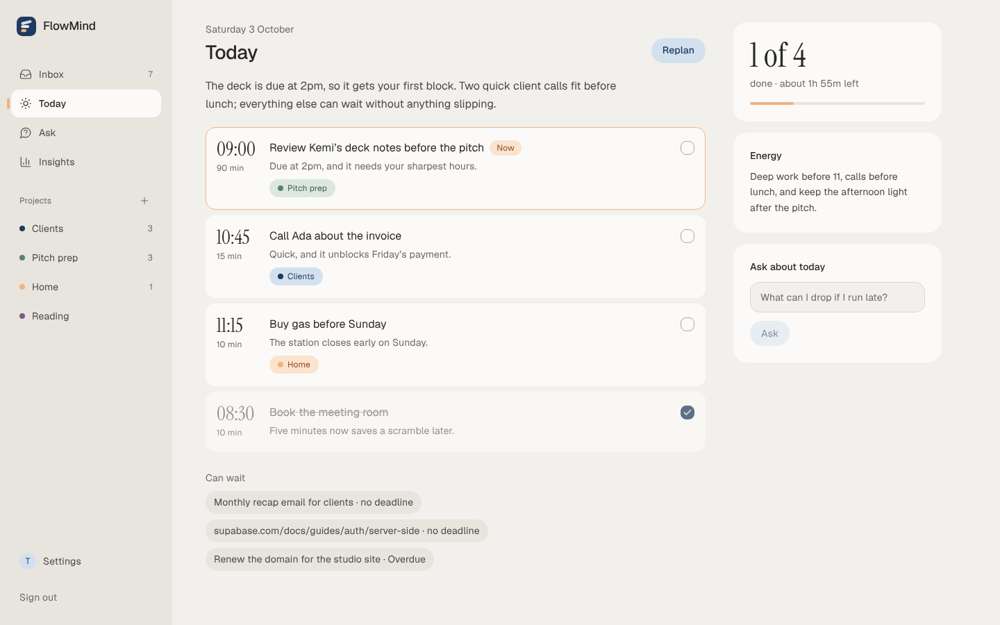
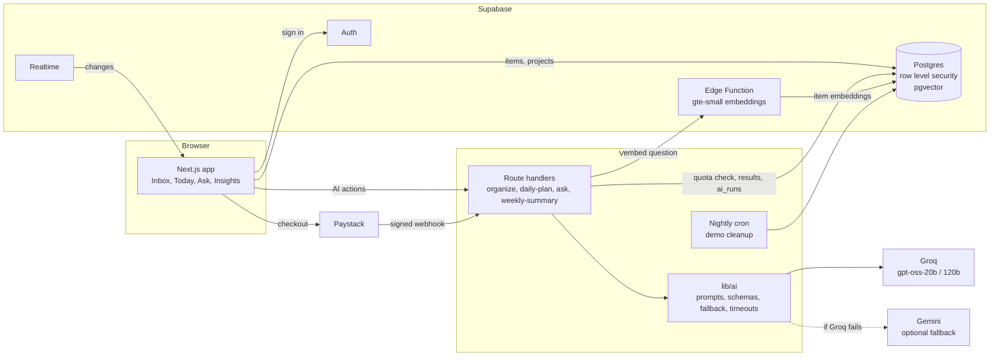

# FlowMind

A second brain for people with too many inputs: drop in tasks, notes, links and half-ideas, and FlowMind files them, plans your day and answers questions from what you saved.



**[Live demo](https://flowmind-sage.vercel.app)** (press "Try the demo", no sign-up) · [Case study](docs/case-study.md) · [Architecture](docs/architecture.md) · [Decisions](docs/decisions)

## The problem

Things to do arrive all day, in no order: a client asks for something on a call, a link looks worth reading, an idea turns up on the bus. Writing them down is easy. Sorting them, deciding what today is for, and finding one of them again three weeks later is the work that does not get done.

## What it does

- **Capture.** One inbox for everything. Saving never waits on AI.
- **Organize.** Each item is given a kind, a priority, a due date if it has one, tags and a project. Every one of those can be changed with a click.
- **Plan today.** A short plan from what is due and what matters, with a reason for each step and a list of what can wait.
- **Ask your notes.** Ask in your own words and get an answer from your own items, with the notes it used linked beside it. If the answer is not in your notes, it says so.
- **Reflect weekly.** What was planned against what got done, per day and per project, with one thing to keep and one to try. Every number is computed in SQL; the model only writes the words.

Around that: email and Google sign-in, a free plan with 50 AI actions a month, Pro through Paystack in naira, light and dark themes, export and account deletion.

## How it works



1. The browser writes an item straight to Postgres, where row level security limits every table to its owner. It appears at once.
2. The app then asks `/api/items/organize` to file it. The route checks the quota, makes one structured model call, validates the answer against a schema and writes the fields back.
3. A daily plan ranks the open items in SQL, streams the model's plan, and rejects any step that is not one of the items it was given.
4. Ask embeds the question in a Supabase Edge Function, runs one SQL search that merges nearest embeddings with keyword matches, and sends the top 8 items to the model. The answer comes back as claims with source numbers; code places the citations.
5. Every model call is logged in `ai_runs` with its provider, model, prompt version, tokens and latency. The free plan's quota is a count of those rows.

## Engineering decisions

Each has a short record in [`docs/decisions`](docs/decisions).

- **Billing and quota are server-owned.** The first version let any signed-in user set their own plan to Pro from the browser, because the plan lived in a row they could update. Plan and usage now sit in tables only the service role can write, with database tests that try the attack. The alternative, column-level rules on one table, would have been one careless policy away from the same hole. ([006](docs/decisions/006-billing-and-quota.md))
- **One small AI module, no framework.** Each feature is a single structured call, so LangChain came out and `src/lib/ai` went in: one function for validated output, one for streaming, a provider fallback, a timeout, and a log row per attempt. ([004](docs/decisions/004-ai-pipeline.md))
- **The model never produces a number.** Counts, rates and trends are computed in SQL and handed to the model to write about. The weekly "focus score" the old version asked the model to invent is gone.
- **Retrieval inside Postgres.** Items are short, so one item is one chunk, embedded with the gte-small model that runs inside Supabase. pgvector and full-text search live in the same database as the items, so one SQL function does hybrid search under the same row level security as everything else. A separate vector store would have meant a second copy of private notes and a second access model. ([005](docs/decisions/005-ask-your-notes.md))
- **A plan step is done when its item is done.** Plan steps are rows that point at inbox items, and progress is counted. The old version stored steps as JSON with its own "done" flags and a stored total, and the two drifted.

## AI quality

Run against the real models; cases and scoring are in [`evals/`](evals). Latest committed runs (3 October 2026):

| Feature | Model | Cases | Result | Latency p50 / p95 |
|---|---|---|---|---|
| Organize: kind, due date, actionable, priority, ignores instructions inside a note | `openai/gpt-oss-20b` | 40 | 100% | 0.6 s / 1.5 s |
| Organize: project | `openai/gpt-oss-20b` | 25 | 92% | |
| Daily plan: only real items, due items included, ordering, step count, total time | `openai/gpt-oss-120b` | 15 | 100% | 1.4 s / 3.1 s |
| Ask: retrieval, recall@8 (hybrid) | gte-small + Postgres | 32 | 1.00, MRR 0.75 | 0.13 s / 0.26 s |
| Ask: answer cites the note that holds the answer | `openai/gpt-oss-120b` | 32 | 32 of 32 | |
| Ask: says "not found" when no note answers | `openai/gpt-oss-120b` | 8 | 8 of 8 | |

Organize uses about 1,200 tokens per item and a plan about 1,000. Everything runs on Groq's free tier, so the cost per request is zero and the limit is tokens per minute.

These are small sets. The Ask numbers come from one seeded account of 48 items, where embeddings alone score the same recall as hybrid search; they show the pipeline works end to end, not how it holds up at thousands of notes.

## Tech stack

- **Frontend:** Next.js 15 (App Router), React 19, Tailwind v4 with a small token-based design system (`docs/design.md`). One deploy, and server routes beside the screens that use them.
- **Data:** Supabase Postgres with row level security, pgvector, Realtime and Auth. Schema as migrations, types generated from them, pgTAP tests for the security rules.
- **AI:** Vercel AI SDK with Groq (`gpt-oss-20b` for filing, `gpt-oss-120b` for plans, reflections and answers) and Gemini as an optional fallback. Zod schemas on every output. gte-small embeddings in a Supabase Edge Function.
- **Payments:** Paystack, because the first users are in Nigeria and pay in naira.
- **Infra:** Vercel (hosting, one nightly cron), GitHub Actions (lint, types, unit tests, build, and a database job that applies every migration, runs the pgTAP tests and checks the generated types).

## Run locally

You need Node 22, Docker (for the local Supabase) and a free Groq key from [console.groq.com/keys](https://console.groq.com/keys).

```bash
git clone https://github.com/Elisabeth56/FlowMind.git
cd FlowMind
npm install

npx supabase start          # local Postgres, Auth and API, with the demo data seeded
cp .env.example .env.local
```

Fill `.env.local`:

- `NEXT_PUBLIC_SUPABASE_URL`, `NEXT_PUBLIC_SUPABASE_ANON_KEY`, `SUPABASE_SERVICE_ROLE_KEY`: printed by `npx supabase status` (API URL, anon key, service_role key)
- `NEXT_PUBLIC_APP_URL=http://localhost:3000`
- `GROQ_API_KEY`: your key
- `PAYSTACK_SECRET_KEY`: any value if you are not testing payments, for example `sk_test_local`

```bash
npm run dev                 # http://localhost:3000, then "Try the demo"
npx supabase functions serve   # in a second terminal, only needed for Ask your notes
```

Checks: `npm run lint`, `npm run typecheck`, `npm test`, `npm run build`, and `npm run db:test` for the database tests.

## Demo setup

"Try the demo" gives each visitor an account of their own, filled with a seeded week, and
signs them in. Nobody sees anyone else's demo. It needs nothing beyond the service role
key the app already uses.

Demo accounts are deleted a day after they are made by a nightly job
(`/api/cron/demo-cleanup`, 03:00 UTC, in `vercel.json`). For that job to run, set
`CRON_SECRET` in Vercel to any long random string; Vercel sends it to the job. The same
nightly query keeps a free Supabase project from pausing for inactivity.

Limits, in `src/lib/demo.ts`: 30 AI actions per demo account and 600 across all of them
per day (they share the model key), and at most 300 demo accounts at a time.

## Ask your notes setup

Search and answers need one Edge Function, deployed once per Supabase project:

```
supabase functions deploy embed
```

It embeds items and questions with gte-small, the model built into Supabase's edge
runtime, so it needs no key. Items are embedded the first time the Ask screen is opened
and again after they are edited. If the function is not deployed, Ask falls back to
keyword search.

## Auth setup

Sign-up, sign-in, Google and password reset run on Supabase Auth. Three things are set
once in the dashboards; the code needs no keys for any of them.

**1. URLs** (Supabase → Authentication → URL Configuration)

- Site URL: the production address, for example `https://flowmind.example`
- Redirect URLs: `https://flowmind.example/auth/callback**` and
  `http://localhost:3000/auth/callback**`. Add the Vercel preview pattern too if previews
  should be able to sign in: `https://*-<your-team>.vercel.app/auth/callback**`

**2. Email templates** (Supabase → Authentication → Email Templates)

Paste the three files from `supabase/templates/` into "Confirm signup", "Reset password"
and "Change email address". Their links go to `/auth/confirm` with a token hash, so a
link opened on a different device still signs the person in.

**3. Google** (optional)

1. Google Cloud Console → APIs & Services → Credentials → Create credentials → OAuth
   client ID → Web application.
2. Authorised redirect URI: `https://<project-ref>.supabase.co/auth/v1/callback`
3. Copy the client ID and secret into Supabase → Authentication → Providers → Google,
   and enable the provider.

Until step 3 is done the Google button answers "That sign-in method is not available
right now."

## AI providers

Every model call goes through `src/lib/ai/index.ts`. It tries Groq's model for the job,
then Groq's other model (free limits are per model), then Gemini if a key is set.

When nothing answers, the app degrades: capture always saves, an item that could not be
organised is marked for retry, and the daily plan is built by rule (due first, then
priority) and says so. Prompts are files in `src/lib/ai/prompts/`, each with a version
that is logged with every call in `ai_runs`.

## Limitations and next steps

- No email is sent by the app itself: there are no reminders, and the "daily plan time" setting only decides when a plan starts its first step.
- The evals are small and the retrieval eval covers one seeded account. A larger, messier set of notes is the next thing to measure.
- Realtime sync across tabs and the Paystack flows have unit and database tests but have not been load tested.
- There are no terms or privacy pages yet.

## Licence

[MIT](LICENSE)

## Author

Elisabeth Nnamani · [elisabethnnamani.dev](https://elisabethnnamani.dev) · [GitHub](https://github.com/Elisabeth56)
